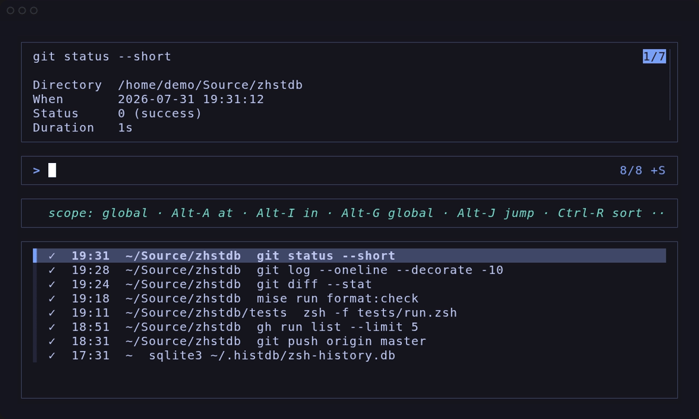

<div align="center">

# zhstdb

Zsh history in SQLite made simple. No binaries, no fluff.

<a href="doc/assets/demo.mp4"></a>

</div>

## Installation

zhstdb requires Zsh, standard core utilities, and SQLite. FZF is only required for the optional picker.

**Git**:

```zsh
git clone https://github.com/hschne/zhstdb "$HOME/.local/share/zhstdb"
source "$HOME/.local/share/zhstdb/zhstdb.plugin.zsh"
```

**Zinit**:

```zsh
zinit light hschne/zhstdb
```

## Usage

History recording starts when the plugin is loaded. Use `histdb` to search, `histdb-top` to list frequent commands, and `histdb-fzf-widget` for interactive
search.

## Configuration

Set configuration variables before sourcing the plugin.

| Variable                 | Default                                   | Purpose                                                      |
| ------------------------ | ----------------------------------------- | ------------------------------------------------------------ |
| `HISTDB_FILE`            | `$HOME/.histdb/zsh-history.db`            | Database path                                                |
| `HISTDB_HOST`            | `$HOST`                                   | Hostname stored with new entries                             |
| `HISTDB_TABULATE_CMD`    | `column`                                  | Query output formatter                                       |
| `HISTORY_IGNORE`         | Unset                                     | Zsh glob for commands that should not be recorded            |
| `HISTDB_IGNORE_PATTERNS` | Common navigation and monitoring commands | Regular expressions for commands that should not be recorded |

## Querying history

Run `histdb` to query history for the current host:

```text
histdb git status
histdb --in "$HOME/Source"
histdb --at "$PWD"
histdb --from today --status error
histdb --desc --limit 100
histdb --detail
```

Run `histdb --help` for all options.

### Forgetting entries

```text
histdb old-command --forget
histdb --at /removed/project --forget --yes
```

## FZF

The plugin defines `histdb-fzf-widget`. Bind it after loading other FZF key
bindings:

```zsh
bindkey -M emacs '^R' histdb-fzf-widget
bindkey -M viins '^R' histdb-fzf-widget
bindkey -M vicmd '^R' histdb-fzf-widget
```

The picker starts with the current command buffer and initially searches the
current directory tree on the current host.

- `M-a`: current directory
- `M-i`: current directory tree
- `M-g`: all directories on the current host
- `M-j`: change to the selected command's directory
- `C-r`: toggle result sorting
- `C-/`: toggle the metadata preview

Selecting a command inserts it into the buffer without executing it.

## Autosuggestions

`zsh-autosuggestions` can query the database through `_histdb_query`:

```zsh
_zsh_autosuggest_strategy_histdb() {
    local command_prefix="$(sql_escape "$1")"
    suggestion="$(_histdb_query "
        select commands.argv
        from history
        join commands on history.command_id = commands.id
        join places on history.place_id = places.id
        where places.host = '$(sql_escape "$HISTDB_HOST")'
          and commands.argv like '${command_prefix}%'
        group by commands.argv
        order by max(history.start_time) desc
        limit 1;
    ")"
}
ZSH_AUTOSUGGEST_STRATEGY=histdb
```

## Database Notes

This fork does not migrate old databases, nor does it offer migrations. Just re-import your history.

This project does not provide database merging or cross-machine synchronization. Use SQLite-aware backup or replication tooling when needed.

## Contributing

Issues and pull requests are welcome. Install the development tools and run the checks before submitting changes:

```sh
mise install
mise run format:check
zsh -n *.zsh tests/*.zsh
zsh -f tests/run.zsh
```

### Assets

Regenerate the demo GIF, MP4, and still from `doc/demo.tape`. Requires [VHS](https://github.com/charmbracelet/vhs) and [FFmpeg](https://www.ffmpeg.org/).

```sh
doc/render-demo.sh
```

## Mentions

`zhstdb` is a fork and substantial rewrite of [`larkery/zsh-histdb`](https://github.com/larkery/zsh-histdb). Many thanks to the original author!

## License

[MIT](LICENSE) © 2019 Tom Hinton, 2026 Hans Schnedlitz
